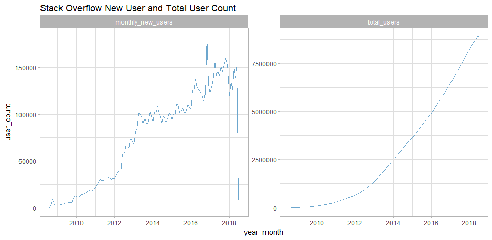
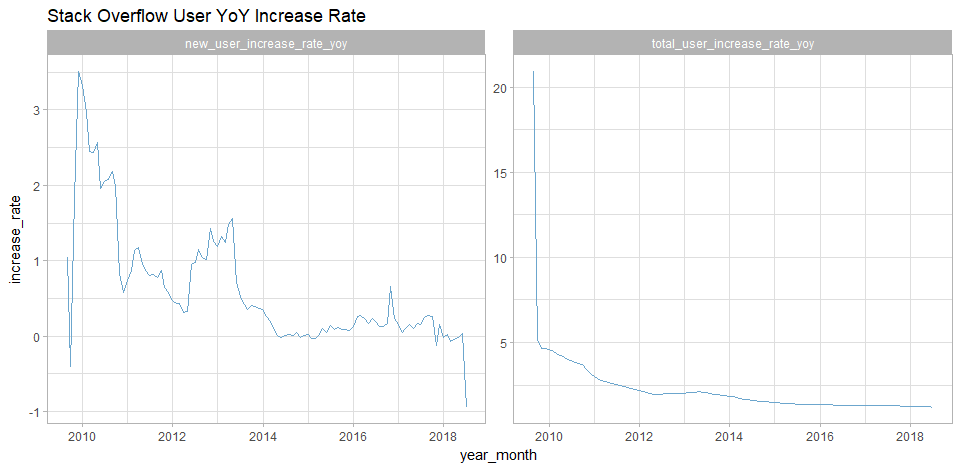
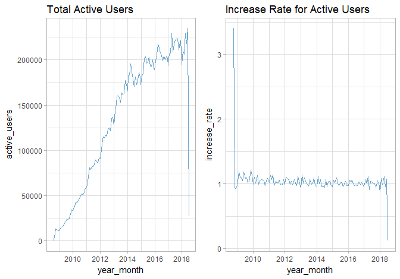
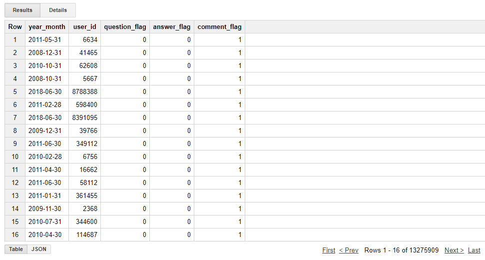

Stack Overflow User Analysis
================
Yifu Yan
2018-6-26

Project Description
-------------------

This project uses Stack Overflow's public dataset on Google Big Query to perform analysis on users' data. Current analysis includes users' increase rate and behavior pattern.

Notice
------

Executable Rmd file is saved in [README.Rmd](README.Rmd), which is used to create this report. Seperate sql file is saved in [stack\_overflow\_query.sql](stack_overflow_query.sql).

1. Monthly New Users and Total Users
------------------------------------

As shown in the graph above, monthly new users for Stack Overflow are increasing steadily. The speed of the increase is also increasing, after 2014, the speed of increase became more steady. But at the end of 2016, there was a spike of increase in new users, this worthes looking into.
On the other hand, total users increases steadily after 2014.

2. Users' monthly Year over Year increase
-----------------------------------------

As shown in the graph above, before 2014, the YoY increase of new users are usually higher than 200%. After 2014, the increase rate is steady around 120% except for the end of 2016. On the other hand, the YoY increase rate for total users are over 500% before 2010, After that point, the YoY increase rate continuously decreases.

3. Stack Overflow Active User Analysis
--------------------------------------

Stack Overflow's active users are increasing steadily. And the increase rate for active users are always around 100%.

4. User Status
--------------

Following Analysis display how how many users have what types of activities.

Using the table above for further analysis, we can get the conclusion that: Among all 13 million Stack Overflow users, they are only three behavior types, and percentages bettwen them are shown in the table below:

|                | percentage |
|----------------|:-----------|
| no\_activity   | 0%         |
| only\_question | 0%         |
| only\_answer   | 0%         |
| only\_comment  | 26.1%      |
| no\_comment    | 20.2%      |
| no\_answer     | 0%         |
| no\_question   | 0%         |
| all\_activity  | 53.7%      |
